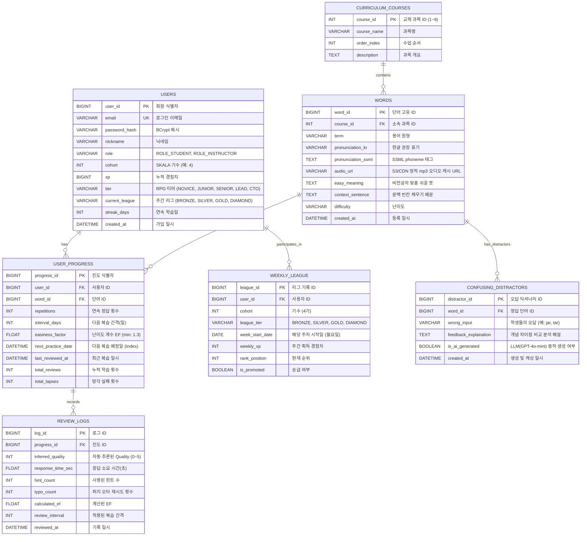

# [SKAVOCA] 데이터 모델링 (ERD 및 DB 스키마 설계서)

> **Note**: 본 설계 문서상에는 OpenAI/GPT가 명시되어 있으나, 실제 구현은 **Google Gemini API** (무료 티어)를 사용하도록 변경되었습니다.

## 1. 개요 및 설계 철학
본 데이터 모델은 **암묵적 SM-2 텔레메트리 연산**, **LLM 동적 오답 피드백 Cache-Aside**, **S3/CDN 정적 오디오 캐싱**, **기수 기반 주간 랭킹 리그 & RPG 티어 게이미피케이션**을 완벽하게 수용하도록 확장 설계되었습니다.

---

## 2. ERD 다이어그램 (Entity Relationship Diagram)



---

## 3. dbdiagram.io 전용 최신 DBML 코드

```dbml
// SKAVOCA Advanced Database Model in DBML
// Featuring Implicit SM-2, LLM Feedback Cache-Aside, S3 Audio & Gamification

Table users {
  user_id bigint [pk, increment, note: '회원 식별자']
  email varchar(100) [unique, not null, note: '로그인 이메일']
  password_hash varchar(255) [not null, note: 'BCrypt 해시']
  nickname varchar(50) [not null, note: '닉네임']
  role varchar(20) [not null, default: 'ROLE_STUDENT', note: 'ROLE_STUDENT | ROLE_INSTRUCTOR']
  cohort int [not null, default: 4, note: 'SKALA 기수 (예: 4기)']
  xp bigint [not null, default: 0, note: '누적 경험치']
  tier varchar(20) [not null, default: 'NOVICE', note: 'NOVICE | JUNIOR | SENIOR | LEAD | CTO']
  current_league varchar(20) [not null, default: 'BRONZE', note: 'BRONZE | SILVER | GOLD | DIAMOND']
  streak_days int [not null, default: 1, note: '연속 학습일']
  created_at datetime [default: `now()`]
}

Table curriculum_courses {
  course_id int [pk, increment, note: '과목 식별자 (1~9)']
  course_name varchar(100) [not null, note: '과목 공식 명칭']
  order_index int [not null, note: '수업 진행 순서']
  description text [note: '과목 개요']
}

Table words {
  word_id bigint [pk, increment, note: '단어 고유 식별자']
  course_id int [ref: > curriculum_courses.course_id, not null, note: '소속 교재 과목']
  term varchar(100) [not null, note: '용어 원형 (yaml, kubectl 등)']
  pronunciation_kr varchar(100) [not null, note: '한글 권장 표기 (야믈, 쿠브씨티엘)']
  pronunciation_ssml text [not null, note: 'W3C SSML phoneme 태그']
  audio_url varchar(255) [not null, note: 'AWS S3 / CloudFront CDN 정적 mp3 URL']
  easy_meaning text [not null, note: '비전공자 맞춤 쉬운 뜻풀이']
  context_sentence text [not null, note: '문맥 빈칸 채우기 예문']
  difficulty varchar(20) [default: 'MEDIUM']
  created_at datetime [default: `now()`]
}

Table confusing_distractors {
  distractor_id bigint [pk, increment, note: '오답 해설 ID']
  word_id bigint [ref: > words.word_id, not null, note: '정답 단어 ID']
  wrong_input varchar(100) [not null, note: '오답 단어 (예: jar, tar)']
  feedback_explanation text [not null, note: '지능형 개념 비교 피드백 해설']
  is_ai_generated boolean [not null, default: false, note: 'GPT-4o-mini 생성 여부']
  created_at datetime [default: `now()`, note: '생성 및 캐싱 일시']

  indexes {
    (word_id, wrong_input) [unique]
  }
}

Table user_progress {
  progress_id bigint [pk, increment, note: '학습 진도 식별자']
  user_id bigint [ref: > users.user_id, not null, note: '사용자 ID']
  word_id bigint [ref: > words.word_id, not null, note: '단어 ID']
  repetitions int [not null, default: 0, note: '연속 정답 횟수']
  interval_days int [not null, default: 0, note: '다음 복습 간격(일)']
  easiness_factor float [not null, default: 2.5, note: '난이도 계수 EF (min 1.3)']
  next_practice_date datetime [not null, note: '다음 복습 예정일 (Index)']
  last_reviewed_at datetime [note: '최근 학습 일시']
  total_reviews int [default: 0, note: '누적 리뷰 횟수']
  total_lapses int [default: 0, note: '망각 실패 횟수']

  indexes {
    (user_id, word_id) [unique]
    (user_id, next_practice_date)
    easiness_factor
  }
}

Table review_logs {
  log_id bigint [pk, increment, note: '리뷰 로그 식별자']
  progress_id bigint [ref: > user_progress.progress_id, not null, note: '학습 진도 ID']
  inferred_quality int [not null, note: '텔레메트리로 자동 추론된 Quality (0~5)']
  response_time_sec float [not null, note: '응답 소요 시간(초)']
  hint_count int [not null, default: 0, note: '사용된 힌트 수']
  typo_count int [not null, default: 0, note: '퍼지 오타 재시도 횟수']
  calculated_ef float [not null, note: '계산된 EF']
  review_interval int [not null, note: '적용된 Interval']
  reviewed_at datetime [default: `now()`, note: '기록 일시']
}

Table weekly_league {
  league_id bigint [pk, increment, note: '리그 참가 식별자']
  user_id bigint [ref: > users.user_id, not null, note: '사용자 ID']
  cohort int [not null, default: 4, note: '기수 (4기)']
  league_tier varchar(20) [not null, default: 'BRONZE', note: 'BRONZE | SILVER | GOLD | DIAMOND']
  week_start_date date [not null, note: '주차 시작일 (월요일)']
  weekly_xp int [not null, default: 0, note: '주간 획득 경험치']
  rank_position int [note: '순위']
  is_promoted boolean [default: false, note: '상위 리그 승급 여부']

  indexes {
    (cohort, week_start_date, weekly_xp)
    (user_id, week_start_date) [unique]
  }
}
```

---

## 4. 핵심 비즈니스 로직: 암묵적(Implicit) SM-2 Quality 자동 계산 수식

프론트엔드에서 수집된 텔레메트리 지표:
- $T$: 응답 소요 시간(초)
- $H$: 사용한 힌트 개수 (0: 없음, 1: 첫글자, 2: 뜻)
- $R$: 오타 재시도 횟수 (레벤슈타인 유사도 80% 이상 오타 유예)
- $isCorrect$: 최종 정답 여부

```java
// Spring Boot Service Layer Quality Inference Algorithm
public int inferQualityScore(boolean isCorrect, double responseTimeSec, int hintCount, int typoCount) {
    if (!isCorrect) {
        return 0; // 망각/오답 (Again)
    }
    
    // 힌트를 2개 이상 보았거나 응답에 25초 이상 소요된 경우
    if (hintCount >= 2 || responseTimeSec > 25.0) {
        return 2; // 매우 어려움
    }
    
    // 힌트를 1개 보았거나 응답에 10~25초 소요된 경우
    if (hintCount == 1 || responseTimeSec > 10.0 || typoCount >= 2) {
        return 3; // 보통/어려움 (Hard)
    }
    
    // 힌트 없이 4~10초 내 정답
    if (responseTimeSec >= 4.0 && responseTimeSec <= 10.0) {
        return 4; // 적정 (Good)
    }
    
    // 힌트 없이 4초 미만 쾌속 정답 (망설임 없는 확신)
    return 5; // 쉬움 (Easy)
}
```

- **도출된 $q \in [0, 5]$를 SM-2 표준 공식에 자동 대입**:
  $$EF' = \max\left(1.3, \; EF + (0.1 - (5 - q) \times (0.08 + (5 - q) \times 0.02))\right)$$
- **사용자 경험(UX)**: 사용자는 난이도 평가 버튼을 누를 필요 없이 0.3초 만에 다음 문제로 쾌속 전환됩니다!

---

## 5. DBeaver 연동 및 SQL 스크립트
본 ERD의 실제 DDL 구현체 및 270선 시딩 데이터 SQL 파일은 다음 경로에서 확인할 수 있습니다:
- DDL 스키마: `database/schema.sql`
- 시딩 데이터 (270선 + 데모 유저): `database/seed_data.sql`
- DBeaver 연동 가이드: `database/README_DBEAVER.md`
