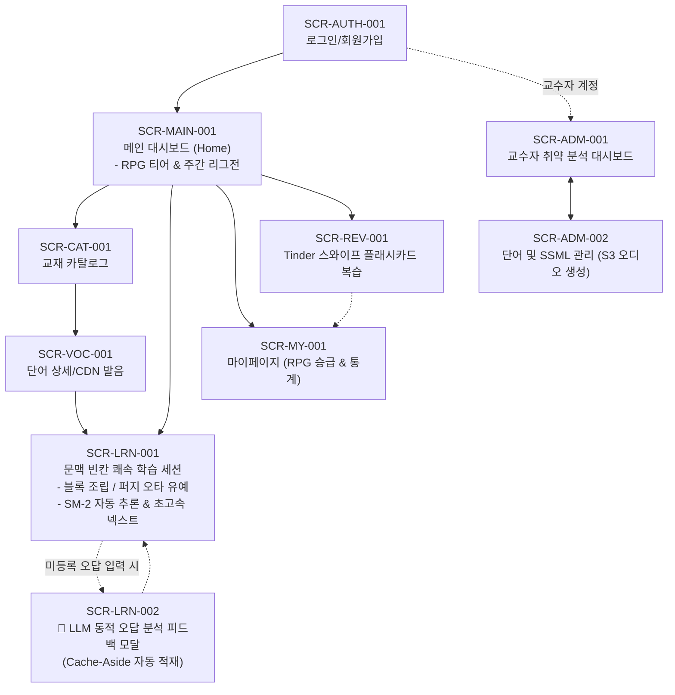

# [SKAVOCA] UI/UX 화면 설계서 (Screen Design Specification)

> **Note**: 본 설계 문서상에는 OpenAI/GPT가 명시되어 있으나, 실제 구현은 **Google Gemini API** (무료 티어)를 사용하도록 변경되었습니다.

## 1. 개요 및 화면 흐름도 (Screen Flow)
본 화면 설계서는 **말해보카식 쾌속 암묵적 평가(Implicit Assessment)**, **레벤슈타인 퍼지 매칭**, **단어 블록 조립 UI**, **LLM 동적 오답 분석**, **게이미피케이션(RPG 티어 & 기수 리그전)**을 완벽히 반영한 모던 에듀테크 UI/UX 명세서입니다.



---

## 2. 화면별 상세 설계서

### [화면 1] SCR-AUTH-001 : 로그인 / 회원가입 화면

#### 1. 기본 정보
- **화면 ID**: `SCR-AUTH-001`
- **화면명**: 로그인 및 회원가입
- **경로**: `/login`, `/signup`
- **관련 요구사항**: `REQ-F-AUTH-001`, `REQ-F-AUTH-002`, `REQ-N-SEC-001`

#### 2. 와이어프레임 (Wireframe)
```
+-------------------------------------------------------------+
|                      [SKAVOCA LOGO]                         |
|         SKALA 4기 비전공자를 위한 IT 전문 어휘 학습 플랫폼       |
|                                                             |
|  +-------------------------------------------------------+  |
|  | [Tab 1] 로그인                    | [Tab 2] 회원가입   |  |
|  +-------------------------------------------------------+  |
|                                                             |
|  ① [ 이메일 입력 (example@sk.com)                     ]     |
|  ② [ 비밀번호 입력 (••••••••••••)                   [👁] ]   |
|  ③ [ 기수 선택 드롭다운 (SKALA 4기 ▼) ] (회원가입 탭 전용)     |
|                                                             |
|  ④ [               로그인 / 회원가입 완료 버튼             ]  |
|                                                             |
|  -------------------------- 또는 ---------------------------  |
|  ⑤ [ [K] 카카오 1초 간편 로그인/가입                       ]  |
|  ⑥ [ [N] 네이버 간편 로그인/가입                           ]  |
|                                                             |
|  ⑦ [비밀번호 찾기]  |  [문의하기]                             |
+-------------------------------------------------------------+
```

#### 3. 디스크립션 (Description)
| NO | 매핑 요구사항 ID | UI 요소명 | 인터랙션 및 비즈니스 로직 | 화면 전환 / 비고 |
|:---:|:---:|:---|:---|:---|
| ① | REQ-F-AUTH-001 | 이메일 입력 필드 | 이메일 정규식 유효성 검증, 우측 `[X]` 삭제 버튼 | - |
| ② | REQ-F-AUTH-001<br>REQ-N-SEC-001 | 비밀번호 입력 필드 | 마스킹 처리 및 눈[👁] 아이콘 클릭 시 토글 | BCrypt 암호화 |
| ③ | REQ-F-AUTH-001 | 기수 선택 드롭다운 | 기본값: "SKALA 4기" (기수 리그전 자동 배정 기준) | `USERS.cohort` 저장 |
| ④ | REQ-F-AUTH-002 | 로그인/가입 버튼 | 유효성 통과 시 활성화, 클릭 시 JWT 발급 | 성공 시 `SCR-MAIN-001` |
| ⑤,⑥ | REQ-F-AUTH-002 | 소셜 간편 로그인 | OAuth 2.0 연동 간편 로그인 | 최초 가입 시 기수 선택 모달 |

---

### [화면 2] SCR-MAIN-001 : 메인 대시보드 (RPG 티어 & 주간 리그전)

#### 1. 기본 정보
- **화면 ID**: `SCR-MAIN-001`
- **화면명**: 메인 대시보드 (Home)
- **경로**: `/`
- **관련 요구사항**: `REQ-F-GAME-001`, `REQ-F-GAME-002`, `REQ-F-SRS-002`, `REQ-F-DASH-001`

#### 2. 와이어프레임 (Wireframe)
```
+-------------------------------------------------------------+
| [SKAVOCA]                   [🔍 검색]  [🔥 7일 스트릭] [👤 프로필] |
+-------------------------------------------------------------+
| ① [ 🛡️ 개발자 성장 티어: Lv.3 주니어 개발자 (EXP: 1,420 / 2,000) ] |
|   [ EXP 게이지:  ■■■■■■■■□□ (71%)  - 다음 티어: 시니어 개발자 ]   |
|                                                             |
|  +-------------------------------------------------------+  |
|  | ② ⚡ 오늘의 복습 덱 (말해보카 쾌속 모드)                  |  |
|  |   - 🔄 복습 대기 어휘: 12개  /  ✨ 신규 어휘: 5개         |  |
|  |   - ⏱ 예상 소요 시간: 약 3분 (문항당 5초 자동 넥스트)    |  |
|  |                                                       |  |
|  |   ③ [        오늘의 쾌속 학습 시작하기 (+100 EXP)       ] |  |
|  +-------------------------------------------------------+  |
|                                                             |
| ④ [ 🏆 SKALA 4기 실시간 주간 랭킹 리그 (골드 리그) ]           |
|  +-------------------------------------------------------+  |
|  | 🥇 1위: 김코딩 (2,840 EXP)   🥈 2위: 이파이 (2,610 EXP)  |  |
|  | 🥉 3위: 박스프링 (2,400 EXP)  👉 7위: 나(홍길동) (1,420)  |  |
|  | [상위 20% 다이아 리그 승급권 획득까지 앞으로 180 EXP!]   |  |
|  +-------------------------------------------------------+  |
|                                                             |
| ⑤ [SKALA 교재별 단어장 바로가기]                       [전체보기] |
|   [ 1. Git (85%) ]   [ 7. SpringBoot (60%) ]   [ 8. MSA (40%) ] |
+-------------------------------------------------------------+
| [하단 네비게이션: 🏠 홈 | 📚 교재단어 | 🏆 리그전 | 📊 마이페이지]  |
+-------------------------------------------------------------+
```

#### 3. 디스크립션 (Description)
| NO | 매핑 요구사항 ID | UI 요소명 | 인터랙션 및 비즈니스 로직 | 화면 전환 / 비고 |
|:---:|:---:|:---|:---|:---|
| ① | REQ-F-GAME-001 | RPG 티어 및 EXP 게이지 | 현재 티어(`코딩 노비` $\to$ `주니어 개발자` $\to$ `시니어 개발자` $\to$ `테크 리드` $\to$ `CTO`) 및 경험치 바 시각화 | 클릭 시 티어 승급 혜택 안내 |
| ②,③ | REQ-F-SRS-002<br>REQ-F-LRN-001 | 일일 학습 덱 & 쾌속 시작 CTA | 클릭 시 17개 큐레이션 단어 덱을 로드하여 **불필요한 평가 화면 없이 0.3초 전환 학습 세션**으로 진입 | `SCR-LRN-001` 이동 |
| ④ | REQ-F-GAME-002 | SKALA 4기 주간 리그 위젯 | `USERS.cohort=4` 교육생들의 이번 주 누적 EXP 실시간 랭킹 Top 3 및 내 순위 렌더링. 상위 20% 승급권 표시 | 실시간 도파민 루프 |
| ⑤ | REQ-F-CAT-001 | 교재별 단어장 퀵링크 | 교재별 학습 진도율 카드 | `SCR-CAT-001` 이동 |

---

### [화면 3] SCR-LRN-001 : 문맥 빈칸 쾌속 학습 세션 (퍼지 매칭 & 블록 조립 UI)

#### 1. 기본 정보
- **화면 ID**: `SCR-LRN-001`
- **화면명**: 문맥 빈칸 쾌속 학습 세션 (말해보카 템포)
- **경로**: `/learning/session`
- **관련 요구사항**: `REQ-F-LRN-001`, `REQ-F-LRN-004`, `REQ-F-LRN-005`, `REQ-F-SRS-001`, `REQ-F-TTS-004`, `REQ-N-PERF-002`

#### 2. 와이어프레임 (Wireframe)
```
+-------------------------------------------------------------+
| [X 종료]   [ ⏱ 0:03 ]   [ 세션 진행: ■■■■□□□□ 4/17 ]   [+20 EXP] |
+-------------------------------------------------------------+
|                                                             |
|  ① [출처: 8. Agile 방법론 및 MSA 개발]                      |
|                                                             |
|  ② 문맥 예문 (Context Sentence):                            |
|     "쿠버네티스 클러스터를 CLI 터미널 환경에서 명령어로       |
|      제어하기 위해 사용하는 도구는 [  ③  ] 이다."           |
|                                                             |
|  ④ [ 🔊 실무 발음 듣기 (CDN 0.1s 재생) ]                     |
|                                                             |
|  ⑤ [ 입력 모드 토글:  🔘 철자 블록 조립  |  ⚪ 가상 키보드 ]   |
|                                                             |
|  +-------------------------------------------------------+  |
|  | ⑥ [ 셔플된 단어/철자 블록 조립 영역 ]                  |  |
|  |    [ k ]   [ u ]   [ b ]   [ e ]   [ c ]   [ t ]   [ l ]   |
|  |    (블록을 탭하면 빈칸 슬롯 ③에 착착 들어갑니다)          |  |
|  +-------------------------------------------------------+  |
|                                                             |
|  ⑦ [ 💡 힌트 보기 (첫 글자) ]           ⑧ [ ⌫ 전체 지우기 ]  |
+-------------------------------------------------------------+
| * 레벤슈타인 퍼지 매칭 토스트 (오타 발생 시):                 |
|   "⚠️ 'kubctl' - 앗, 오타인가요? 1글자가 빠졌어요! (다시 입력)"|
+-------------------------------------------------------------+
| * 정답 입력 즉시:                                           |
|   [ 🟢 정답! 0.3초 녹색 펄스 + '쿠브씨티엘' 오디오 자동 재생 ] |
|   -> 별도 난이도 버튼 없이 0.3초 후 다음 문제로 자동 쾌속 전이! |
+-------------------------------------------------------------+
```

#### 3. 디스크립션 (Description)
| NO | 매핑 요구사항 ID | UI 요소명 | 인터랙션 및 비즈니스 로직 | 화면 전환 / 비고 |
|:---:|:---:|:---|:---|:---|
| ①,② | REQ-F-CAT-001<br>REQ-F-LRN-001 | 교재 배지 & 문맥 제시문 | 교재 출처와 실무 문맥 렌더링, 빈칸 슬롯 바인딩 | - |
| ③ | REQ-F-LRN-001 | 빈칸 입력 슬롯 | 블록 탭 또는 타이핑 시 글자가 실시간 삽입됨 | 정답 완성 시 즉시 검증 |
| ④ | REQ-F-TTS-004<br>REQ-N-PERF-002 | CDN 발음 듣기 | S3/CloudFront CDN에 캐싱된 정적 `.mp3`를 0.1초 만에 재생 (지연/과금 제로) | Spacebar 단축키 |
| ⑤,⑥ | REQ-F-LRN-005 | 블록 조립 UI | 모바일 오타 피로도를 줄이기 위해 셔플된 글자 블록 제공. 탭 시 슬롯에 순서대로 자동 채워짐 | 모바일 극찬 UX |
| ⑦ | REQ-F-LRN-002 | 힌트 버튼 | 힌트 사용 시 텔레메트리 $H = H + 1$ 기록 (SM-2 Quality 계산에 자동 반영) | - |
| - | **REQ-F-LRN-004** | **레벤슈타인 퍼지 매칭** | 오답 입력 시 Levenshtein Distance 계산. **유사도 $\ge 80\%$** (예: `kubctl`)일 경우 오답 처리하지 않고 **"앗, 오타인가요?" 유예 토스트 출력 후 재입력 허용** | 억울한 감점 방지 |
| - | **REQ-F-SRS-001** | **암묵적 SM-2 자동 추론 & 쾌속 넥스트** | 정답 시 소요시간($T$), 힌트($H$), 오타($R$)를 종합하여 **백엔드가 Quality(0~5) 자동 계산 갱신**. 화면은 **0.3초 녹색 펄스 후 즉시 다음 문제로 직행** (수동 평가 팝업 완전 제거) | 말해보카식 텐션 유지 |

---

### [화면 4] SCR-LRN-002 : 🤖 LLM 동적 오답 분석 피드백 모달 (Cache-Aside)

#### 1. 기본 정보
- **화면 ID**: `SCR-LRN-002`
- **화면명**: 🤖 LLM 기반 지능형 오답 비교 분석 모달
- **경로**: `/learning/session` (Modal Overlay)
- **관련 요구사항**: `REQ-F-AI-001`, `REQ-F-AI-002`, `REQ-N-PERF-004`

#### 2. 와이어프레임 (Wireframe)
```
+-------------------------------------------------------------+
| +---------------------------------------------------------+ |
| |  ❌ 틀렸습니다! (오답 분석 리포트)                       | |
| |                                                         | |
| |  [내가 입력한 오답]   tar                                | |
| |  [실제 정답]         war (Web Archive)                  | |
| |                                                         | |
| |  🤖 [AI 튜터의 실시간 3단 구조 피드백 (GPT-4o-mini)]       | |
| |  🔍 개념 차이점 비교:                                   | |
| |   입력하신 tar는 리눅스 환경에서 파일들을 단순히 묶어 보관하는| |
| |   범용 아카이브 포맷이며, Tomcat과 같은 WAS 배포용이 아님. | |
| |                                                         | |
| |  📌 정답 개념 핵심 정의:                                 | |
| |   war는 Web Application Archive의 약자로, 웹 애플리케이션 | |
| |   전체를 패키징하여 WAS에 배포하기 위한 포맷.              | |
| |                                                         | |
| |  💡 실무 기억 & 적용 꿀팁:                               | |
| |   '웹(Web)에 올린다'고 생각하면 w로 시작하는 war를 떠올리세요!| |
| |                                                         | |
| |  🔊 정답 실무 발음: "워 (War)" [▶ 다시 듣기]             | |
| |                                                         | |
| |  [                 이해했습니다 (+5 EXP)               ] | |
| +---------------------------------------------------------+ |
+-------------------------------------------------------------+
| * 시스템 내부 동작:                                         |
|   1. DB에 없는 오답 'tar' 감지 -> OpenAI API 1.0초 비동기 호출|
|   2. 생성된 피드백을 CONFUSING_DISTRACTORS에 자동 캐싱 저장   |
|   3. 다음 학생이 'tar' 입력 시 0ms 지연/0원 비용으로 즉시 서빙 |
+-------------------------------------------------------------+
```

#### 3. 디스크립션 (Description)
| NO | 매핑 요구사항 ID | UI 요소명 | 인터랙션 및 비즈니스 로직 | 비고 |
|:---:|:---:|:---|:---|:---|
| ① | REQ-F-AI-001 | 오답 vs 정답 시각 대조 | 사용자 오답과 실제 정답의 명확한 시각적 대비 | - |
| ② | REQ-F-AI-001<br>REQ-F-AI-002 | LLM 동적 비교 해설 | DB 미등록 오답 입력 시 GPT-4o-mini가 1문장 맞춤 비교 해설 생성. 생성 즉시 DB에 영속화(Cache-Aside) | 무한한 확장성 |
| ③ | REQ-F-TTS-004 | CDN 발음 재생 | 정답 어휘 실무 발음 즉시 청취 | 0.1초 CDN 재생 |
| ④ | REQ-F-SRS-001 | 이해 완료 버튼 | 세션 큐 후순위에 재배치 ($q=0$ 적용) | 세션 복귀 |

---

### [화면 4-1] SCR-REV-001 : Tinder 스와이프 플래시카드 복습 세션

#### 1. 기본 정보
- **화면 ID**: `SCR-REV-001`
- **화면명**: Tinder 스와이프 플래시카드 복습 세션
- **경로**: `/review`
- **관련 요구사항**: `REQ-F-REV-001`, `REQ-F-SRS-001`, `REQ-F-GAME-001`

#### 2. 와이어프레임 (Wireframe)
```
+-------------------------------------------------------------+
| [X 종료]   [ 🔄 복습 진행도: ■■■□□□ 3/10 ]              [XP] |
+-------------------------------------------------------------+
|                                                             |
|           [ ← 다시보기 🔄 ]       [ 👍 기억함 → ]             |
|                                                             |
|   +-----------------------------------------------------+   |
|   |                                                     |   |
|   |                      kubectl                        |   |
|   |               [쿠브씨티엘 (Kube-control)]                |   |
|   |                                                     |   |
|   |   🔊 실무 발음 듣기                                     |   |
|   |                                                     |   |
|   |   📖 뜻: 쿠버네티스 클러스터를 CLI 환경에서               |   |
|   |           명령어로 제어하는 공식 도구                    |   |
|   |                                                     |   |
|   |   💡 예문: 쿠버네티스 환경에서 파드 목록을 조회하기 위해   |   |
|   |           [ kubectl ] get pods 명령어를 사용한다.     |   |
|   |                                                     |   |
|   +-----------------------------------------------------+   |
|                                                             |
|     (카드를 좌우로 스와이프하여 학습 상태를 평가하세요!)         |
+-------------------------------------------------------------+
```

#### 3. 디스크립션 (Description)
| NO | 매핑 요구사항 ID | UI 요소명 | 인터랙션 및 비즈니스 로직 | 비고 |
|:---:|:---:|:---|:---|:---|
| ① | REQ-F-REV-001 | 플래시카드 UI | 단어, 발음, 뜻, 예문이 표시된 대형 카드 UI | 직관적 복습 |
| ② | REQ-F-REV-001 | 스와이프 액션 | 우측 스와이프(기억함) 시 SM-2 Quality 4~5 적용, 좌측 스와이프(다시보기) 시 Quality 0~2 적용 | 텐더 스타일 모바일 최적화 |
| ③ | REQ-F-SRS-001 | 복습 로직 | 스와이프 결과에 따라 텔레메트리 업데이트 및 백엔드에 SM-2 결과 전송 | - |

---

### [화면 5] SCR-MY-001 : 마이페이지 (RPG 성장 로드맵 & 기수 랭킹)

#### 1. 기본 정보
- **화면 ID**: `SCR-MY-001`
- **화면명**: 마이페이지 및 RPG 성장 로드맵
- **경로**: `/mypage`
- **관련 요구사항**: `REQ-F-GAME-001`, `REQ-F-GAME-002`, `REQ-F-DASH-001`

#### 2. 와이어프레임 (Wireframe)
```
+-------------------------------------------------------------+
| [←] 마이페이지 & 개발자 성장 로드맵                  [설정 ⚙️] |
+-------------------------------------------------------------+
| ① [ 홍길동 | SKALA 4기 | Lv.3 주니어 개발자 (골드 리그) ]     |
|   [ 다음 승급까지: 580 EXP 남음 | 보유 배지: 🔥7일스트릭, 🎯원샷] |
|                                                             |
| ② [ 🗺️ 개발자 성장 티어 로드맵 ]                             |
|   [코딩 노비(Lv1)] ➔ [주니어(Lv3)] ➔ [시니어] ➔ [리드] ➔ [CTO] |
|   (현재 위치: '주니어 개발자' - Spring Boot & MSA 어휘 마스터 중)|
|                                                             |
| ③ [ 🏆 SKALA 4기 주간 리그 상세 순위표 (현재 7위) ]          |
|   - 1위~5위: 다이아 리그 승급 (골드 배지 부여)              |
|   - 6위~25위: 골드 리그 유지                                |
|   - 26위 이하: 실버 리그 강등 경고                           |
|                                                             |
| ④ [ 9개 교재별 어휘 숙련도 방사형 차트 & 망각 방어 그래프 ]   |
|   - Git: 92% | Spring: 78% | MSA: 55% | Vue: 40%           |
|                                                             |
| ⑤ [ 🚨 나의 취약 어휘 오답 덱 (SM-2 EF 1.7 이하) ]   [모아풀기] |
+-------------------------------------------------------------+
```

#### 3. 디스크립션 (Description)
| NO | 매핑 요구사항 ID | UI 요소명 | 인터랙션 및 비즈니스 로직 | 비고 |
|:---:|:---:|:---|:---|:---|
| ①,② | REQ-F-GAME-001 | RPG 티어 로드맵 | 티어별 승급 조건(누적 EXP 및 마스터 단어 수) 시각화 | 동기부여 극대화 |
| ③ | REQ-F-GAME-002 | 주간 리그전 순위표 | 기수 동기 간 경쟁 현황 및 승급/강등 컷오프라인 실시간 안내 | 주간 리셋 (일요일 자정) |
| ④ | REQ-F-DASH-001 | 숙련도 레이더 차트 | 9개 과목별 $EF$ 가중 평균 지수 시각화 | 과목별 진도 점검 |
| ⑤ | REQ-F-DASH-002 | 취약 어휘 모아풀기 | $EF \le 1.7$ 단어만 모아 쾌속 복습 세션 생성 | `SCR-LRN-001` 연계 |
